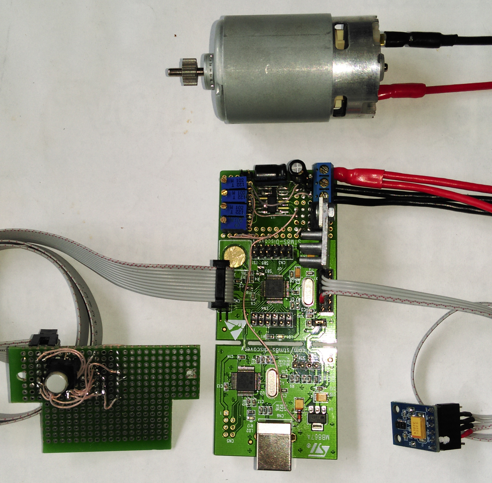

# DrillControl
Firmware for a drill machine based on the STM8S-Discovery board

The program is based on the example: [Generating PWM signals using STM8S-DISCOVERY (AN3332)](https://www.st.com/en/embedded-software/stsw-stm8036.html)

## Description
Firmware is used to control a drill machine with three butonns and a proximity sensor.
Features:
- I2C proximity sensor APDS-9960 is used to activate the motor together with a button.
- Three two-colour LEDs to indicate the current state (can be connected via shift register HC595, or directly to GPIO).
- Three buttons to set the speed.
- Tree variable resisters to set speeds for buttons
- One variable resister to set the proximity threshold

The firmware logic implemented in a single file `Project/PWM/src/main.c`

The board is depicted in the Fig.

Fig. Development board with additional components

## Software requirements
The project was created in IAR EWSTM8. Suitable versions: V1.30+

## Dependencies
- STM8S Standard Peripherals Library V2.0.0
- AN3332 example files
- [Library for the SparkFun APDS-9960 breakout board](https://github.com/sparkfun/SparkFun_APDS-9960_Sensor_Arduino_Library)
- STVD
- [STM8S003F I2C driver](https://git.shilov.pp.ua/shiva/VAPC2/raw/branch/master/lib/i2c.c), http://hamlab.net/

